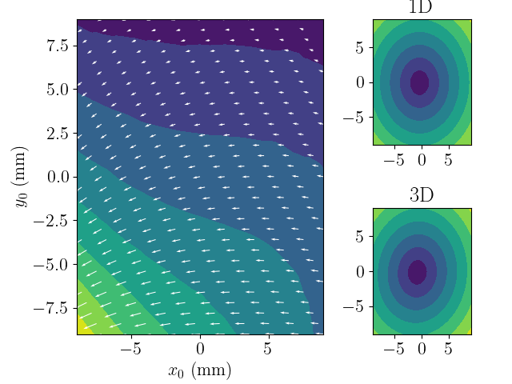
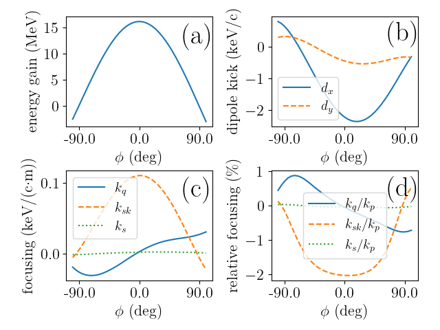

# AWA linac characterization


## Description
Characterize the beam-dynamics properties in a cavity (1D, and 3D) based on early work with A. Halavanau and T. Xu
		            
### file list:
- field for ASTRA : 
   - 3D_asta.* (6 files) contains the 3D field for a TESLA superconducting cavity for ASTRA
   - Ez_axis.dat represent the field on axis for astra (z, Ez)
- ASTRA input file
   - 9-cell3D.in: input file for tracking in a 3D map only and vary the phase from -100 to 100 deg (produces 41 outputs)
   - 9-celltest.in: input file with run #1 trackin in 1D file and run #2 tracking in 3D map 
 - Scripts:
   - MakeGridBeam.py  produce a distribution with small longitudinal size and macroparticle arrange on a 2D grid in (x,y). The transverse moementum is set to zero
   - SeeCouplerKick.py generate a map of the transverse kick (using outputs from runs 1 and 2 produced by 9-celltest.in) 
   - MomentumAnalysis.py compute variation of kick strnegth as a function of phase (from output from 9-cell3D.in)
   
### run
- generate kick 2D map:
   - generate the input distribution ```python MakeGridBeam.py```
   - copy distribution to proper file name (use by Astra) ```cp grid_distrib.ini dist.ini```
   - run ASTRA  ```astra 9-celltest.in```
   - produce 2D map ````python SeeCouplerKick.py```. The Figure below  displays the output you should get by running the script for the field maps considered in this example. 

- analyze multipole components of the kick as a function of phase (following [A. Halavanau et al. PRAB 20, 040102, 2017](https://journals.aps.org/prab/abstract/10.1103/PhysRevAccelBeams.20.040102) originally worked out by [Z. li et al, proc. PAC93, p. 179 (1993)](https://epaper.kek.jp/p93/PDF/PAC1993_0179.PDF):
   - generate the input distribution ```python MakeGridBeam.py```
   - copy distribution to proper file name (use by Astra) ```cp grid_distrib.ini dist.ini```
   - run ASTRA  ```astra 9-cell3D.in```
   - produce 2D map ```python MomentumAnalysis.py``` The Figure below  displays the output you should get by running the script for the field maps considered in this example.  

### other
- the directory figs contains the figure shown in this README.md file. 
